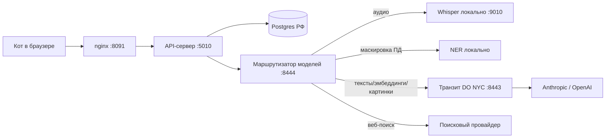

# Рабочая среда Кота — архитектура платформы

Документ составлен по методике «Сложные проекты» (карта ВАЙБКОДИНГ): продукт → пользователи →
сценарии → первый вертикальный срез → сущности → модель данных → API → структура → правила.
Дата: 2026-07-22. Статус: предложение к обсуждению, код по нему ещё не писался.

---

## 0. Что уже есть (инвентаризация на 2026-07-22)

**Работает в проде** (`http://5.129.198.180:8091`, VDS Timeweb, Москва):

| Часть | Состояние |
|---|---|
| Инструмент 1 «Расшифровать запись» | ✅ работает полностью: загрузка аудио → ffmpeg-нарезка по 10 мин → локальный Whisper large-v3-turbo → структурирование текста → маскировка имён → сохранение в Postgres. 63 мин записи ≈ 15 мин обработки |
| Инструмент 2 «Подготовить лекцию» | ❌ имитация: три захардкоженные главы в `Lecture.tsx`, ни бэкенда, ни данных |
| Инструмент 3 «Собрать презентацию» | ❌ имитация: шесть заголовков и градиенты в `Slides.tsx` |
| БД | одна таблица `transcriptions`. Расширений `vector` нет (пакет `postgresql-16-pgvector 0.6.0` доступен в репозитории), `pg_trgm` есть |
| Авторизация | **отсутствует полностью** |
| Фоновые задачи | в памяти процесса, не переживают рестарт |
| Модели | локальный Whisper (9010) + OpenAI через прокси на дроплете DigitalOcean (NYC) |
| Железо | 8 vCPU / 12 ГБ RAM / 100 ГБ NVMe, 80 ГБ свободно. Оплачено до 09.2027 |

**Два дефекта, которые надо закрыть до любой новой функциональности** — см. раздел 10.

---

## 1. Описание продукта

**Что это.** Рабочая среда одного преподающего психоаналитика: превращает её материал —
аудиозаписи, книги, разрозненные заметки — в готовые к использованию тексты лекций и презентации.

**Какую проблему решает.** Между «я знаю тему и у меня есть материал» и «у меня готова лекция на
6 часов со слайдами» лежат десятки часов ручной работы: расшифровать, перечитать источники,
выстроить структуру, написать, собрать слайды, найти иллюстрации. Платформа снимает эту работу,
оставляя человеку то, что не делегируется: выбор темы, утверждение структуры, правку по существу.

**Для кого.** Первый и главный пользователь — Кот (автор лекций). Вторичные — коллеги и студенты,
получающие готовый результат.

**Главный результат пользователя.** Загрузил материал и описал тему своими словами → получил
черновик лекции с проверяемыми источниками и презентацию к ней в своём визуальном стиле.

**Чем продукт НЕ является:**
- не ИИ-психотерапевт и не помощник в клинической работе с пациентом;
- не хранилище медицинских карт и не CRM для практики;
- не универсальный конструктор презентаций «для всех» — только под один авторский стиль;
- не платформа дистанционного обучения (нет курсов, прогресса студентов, тестов);
- не заменяет автора: всё, что выходит наружу, проходит его правку.

---

## 2. Пользователи

| Пользователь | Что хочет получить | Что должен уметь делать | Нужен в MVP |
|---|---|---|---|
| **Кот** (автор) | Готовые лекции и презентации из своего материала | Всё: загружать записи и книги, заказывать лекцию, утверждать план, править текст, собирать презентацию, экспортировать | ✅ главный и единственный |
| **Коллега** | Прочитать/забрать лекцию, обсудить | Открыть ссылку, читать, скачать PDF | ❌ этап 5 (шеринг по ссылке) |
| **Студент** | Материалы курса | Открыть ссылку, читать, скачать | ❌ этап 5 |
| **Ассистент** | Помочь с загрузкой материала | Загружать документы, видеть черновики, не видеть расшифровки сеансов | ❌ позже, если появится |

Вывод для архитектуры: **на первом этапе система однопользовательская**, но роли и владение
объектами закладываются в модель данных сразу, иначе потом переписывать всё.

---

## 3. Главные сценарии

| # | Кто | Что делает | Зачем | Результат | MVP |
|---|---|---|---|---|---|
| С1 | Кот | Загружает запись сеанса/лекции | Получить текст | Расшифровка с маскированными именами | ✅ готово |
| С2 | Кот | Загружает книги и статьи в библиотеку | Чтобы лекции опирались на его источники | Документы разобраны и проиндексированы | ✅ **первый срез** |
| С3 | Кот | Описывает тему лекции → получает план → утверждает → получает текст | Подготовить лекцию | Текст по главам со ссылками на источники | ✅ **первый срез** |
| С4 | Кот | Просит дополнить лекцию свежими внешними источниками | Актуальность, обзор литературы | Главы с веб-источниками и цитатами | ⬜ этап 2 |
| С5 | Кот | Собирает презентацию из готовой лекции | Материал для выступления | Колода слайдов «по существу» + экспорт | ⬜ этап 3 |
| С6 | Кот | Собирает презентацию из загруженного текста (не из лекции) | Быстрый деск под чужой/старый материал | То же | ⬜ этап 3 |
| С7 | Кот | Заказывает метафорические иллюстрации в своём стиле | Визуальный язык выступления | Серия картинок в едином стиле | ⬜ этап 4 |
| С8 | Кот | Делится лекцией/презентацией по ссылке | Отдать коллегам и студентам | Публичная ссылка только на выбранное | ⬜ этап 5 |
| С9 | Кот | Правит любой сгенерированный текст | Авторский контроль | Сохранённая правка | ✅ вместе с С3 |

---

## 4. Первый сценарий (вертикальный срез)

**«Лекция из моих документов»** — С2 + С3 без веб-исследования и без презентаций.

Почему именно он:
1. Проверяет главную гипотезу продукта: получается ли **лекция, которую не стыдно читать**.
2. Не требует внешнего поиска — меньше движущихся частей, дешевле в отладке.
3. Даёт ценность сразу: даже одна готовая лекция окупает работу.
4. Строит фундамент для всего остального: библиотека документов, движок фоновых задач,
   человек-в-цикле, экспорт — всё это переиспользуют инструменты 2 и 3.

**Что входит:** загрузка PDF/DOCX/EPUB/TXT → разбор и индексация → бриф лекции (тема, аудитория,
длительность, что не включать) → генерация плана глав → **утверждение/правка плана человеком** →
написание глав по очереди с цитатами из библиотеки → чтение и правка в интерфейсе → экспорт в
Markdown/DOCX.

**Что НЕ входит:** веб-поиск, презентации, картинки, шеринг, совместная работа, версии документов.

**Ключевое решение — человек в цикле после плана.** Генерация шестичасовой лекции — это десятки
минут работы и заметные деньги. Согласовывать структуру ДО написания дешевле, чем переделывать
после. План — это точка, где автор остаётся автором.

**Какие данные понадобятся:** документы и их фрагменты с эмбеддингами; бриф; план; главы; источники.

**Какие экраны:** Библиотека, Новая лекция (форма брифа), Утверждение плана, Работа (прогресс),
Лекция (чтение/правка/экспорт).

---

## 5. Слой моделей: как работать из России без ВПН

Принцип: **приложение не знает, где живут модели.** Оно ходит в один внутренний адрес
(`127.0.0.1:8444`), а маршрутизатор решает — локально или за границу через собственный транзит.



| Задача | Чем решаем | Где выполняется |
|---|---|---|
| Распознавание речи | faster-whisper large-v3-turbo | 🇷🇺 локально, уже работает |
| Маскировка персональных данных | NER для русского (natasha/slovnet) | 🇷🇺 локально, **новое** |
| Планы, написание лекций, структурирование | Claude (осн.) / OpenAI (резерв) | 🌍 через транзит |
| Эмбеддинги для поиска по книгам | OpenAI embeddings или локальный e5 | 🌍/🇷🇺 |
| Метафорические иллюстрации | gpt-image-1 | 🌍 через транзит |
| Веб-исследование | поисковый API (абстракция провайдера) | 🌍/🇷🇺 |

Что нужно доработать в транзите: сейчас он умеет только `→ api.openai.com`. Нужен
мультиапстрим по префиксу пути (`/openai/*`, `/anthropic/*`, `/search/*`) — правка на 20 строк.

**Слабое место, которое надо назвать вслух:** дроплет DigitalOcean — единственная точка выхода.
Умрёт он — встанут лекции и картинки (расшифровка продолжит работать, она локальная). Лечится
вторым транзитом у другого провайдера или переключением на российские модели как запасной путь;
на первом этапе — принимаем риск осознанно.

---

## 6. Backend: сущности

| Сущность | Смысл | Зона данных |
|---|---|---|
| `User` | Кто работает в системе | А |
| `Transcription` | Расшифровка записи (есть) | **А (спец. категория)** |
| `Document` | Загруженная книга/статья/заметка | Б |
| `DocChunk` | Фрагмент документа + эмбеддинг | Б |
| `Lecture` | Лекция: бриф, план, статус | Б |
| `LectureSection` | Глава лекции | Б |
| `Source` | Источник под утверждением (документ/веб) | Б |
| `Deck` | Презентация | Б |
| `DeckSlide` | Слайд | Б |
| `Image` | Сгенерированная иллюстрация | Б |
| `StylePack` | Стилевой пакет (промпт-префикс, палитра) | Б |
| `Job` | Единица фоновой работы | — |
| `ShareLink` | Публичная ссылка на лекцию/презентацию | Б |

Позже, но сейчас не трогаем: `Course`, `Comment`, `Version`, `Assistant`.

### Ядро: очередь задач

Все три инструмента — это долгие фоновые процессы с прогрессом. Сегодня они живут в памяти и
гибнут при рестарте (известная проблема расшифровки). Заменяем на **очередь в Postgres**:

- `jobs` с `SELECT … FOR UPDATE SKIP LOCKED` — без Redis, без брокеров, для одного пользователя
  этого достаточно с запасом;
- отдельный systemd-воркер `kotu-worker` — падение воркера не роняет сайт, деплой перезапускает
  их независимо;
- ретраи по шагам: упавшая глава/кусок аудио переделывается сама, а не «загрузите файл заново»;
- задача переживает деплой — можно выкатывать обновления, не боясь убить чужую расшифровку.

Это самая важная инженерная правка во всём документе: без неё лекция на 40 минут работы будет
регулярно теряться.

---

## 7. Модель данных (первый срез)

Только то, что нужно для «лекции из моих документов». Полей «на будущее» не добавляем.

```
users
  id            serial PK
  email         text уникальный        обяз.   "kot@example.ru"   — вход
  password_hash text                   обяз.                      — argon2id
  name          text                   обяз.   "Кот"              — подпись в интерфейсе
  role          text                   обяз.   "owner"            — owner | assistant | reader
  created_at    timestamptz            обяз.

documents
  id            serial PK
  owner_id      → users.id             обяз.
  title         text                   обяз.   "Мак-Вильямс. Психоаналитическая диагностика"
  kind          text                   обяз.   "book"             — book | article | note | transcript
  source_path   text                   обяз.   "/opt/kotu/library/12.pdf"
  mime          text                   обяз.   "application/pdf"
  pages         integer                нет     412
  status        text                   обяз.   "ready"            — uploaded | parsing | ready | error
  error         text                   нет
  created_at    timestamptz            обяз.

doc_chunks
  id            bigserial PK
  document_id   → documents.id          обяз.
  ord           integer                 обяз.   17                — порядок для сборки цитаты
  page          integer                 нет     84                — чтобы сослаться на страницу
  heading       text                    нет     "Глава 3. Защиты"
  text          text                    обяз.                     — сам фрагмент, ~1000 знаков
  embedding     vector(1536)            нет                       — NULL пока не проиндексирован
  tsv           tsvector generated                                — полнотекст, русский словарь

lectures
  id            serial PK
  owner_id      → users.id              обяз.
  title         text                    обяз.   "Защитные механизмы личности"
  brief         jsonb                   обяз.   {topic, audience, duration_min, must_include, must_avoid, doc_ids}
  plan          jsonb                   нет     [{heading, abstract, doc_refs}]
  plan_approved boolean                 обяз.   false             — человек в цикле
  status        text                    обяз.   "draft"           — draft|planning|plan_ready|writing|ready|error
  created_at    timestamptz             обяз.
  updated_at    timestamptz             обяз.

lecture_sections
  id            serial PK
  lecture_id    → lectures.id           обяз.
  ord           integer                 обяз.   2
  heading       text                    обяз.   "Проекция и проективная идентификация"
  text          text                    обяз.                     — тело главы (markdown)
  edited_by_human boolean               обяз.   false             — не перезатирать правку автора
  status        text                    обяз.   "ready"           — pending|writing|ready|error

sources
  id            serial PK
  lecture_id    → lectures.id           обяз.
  section_id    → lecture_sections.id   нет
  kind          text                    обяз.   "doc"             — doc | web
  chunk_id      → doc_chunks.id         нет                       — для kind=doc
  url           text                    нет                       — для kind=web
  title         text                    обяз.   "Мак-Вильямс, с. 84"
  quote         text                    обяз.                     — точная цитата, проверяемая
  created_at    timestamptz             обяз.

jobs
  id            bigserial PK
  kind          text                    обяз.   "lecture.write"   — transcribe|doc.ingest|lecture.plan|lecture.write|deck.build|image.render
  entity_type   text                    обяз.   "lecture"
  entity_id     integer                 обяз.   7
  payload       jsonb                   обяз.   {}
  status        text                    обяз.   "queued"          — queued|running|done|error|cancelled
  progress      integer                 обяз.   0
  step_message  text                    обяз.   "Пишу главу 2 из 6…"
  attempts      integer                 обяз.   0
  last_error    text                    нет
  locked_at     timestamptz             нет                       — для SKIP LOCKED
  created_at    timestamptz             обяз.
  finished_at   timestamptz             нет
```

Правки существующей таблицы `transcriptions`: добавить `owner_id` и `name_map jsonb`
(соответствие «плейсхолдер → настоящее имя», хранится **только локально**, см. раздел 10).

Для презентаций (этап 3) добавятся `decks`, `deck_slides`, `images`, `style_packs` —
проектируются, когда дойдём, чтобы не плодить неиспользуемые поля.

---

## 8. API-контракт (первый срез)

Стиль сохраняем существующий: REST, контракт-первый (`lib/api-spec/openapi.yaml`), хуки для
фронта генерируются Orval. Все ответы — JSON. Все ручки, кроме `/auth/*` и `/healthz`, требуют
сессионную cookie.

| Метод | Путь | Отправляем | Получаем | Ошибки |
|---|---|---|---|---|
| POST | `/auth/login` | `{email, password}` | `{user}` + httpOnly cookie | 401 неверный пароль, 429 брутфорс |
| POST | `/auth/logout` | — | 204 | — |
| GET | `/me` | — | `{user}` | 401 |
| POST | `/documents` | multipart: `file`, `title?`, `kind?` | `201 {document}` статус `parsing` | 413 >200 МБ, 415 формат, 401 |
| GET | `/documents` | `?kind=&q=` | `[{document}]` | 401 |
| GET | `/documents/{id}` | — | `{document, chunksCount}` | 404, 403 чужой |
| DELETE | `/documents/{id}` | — | 204 (файл и фрагменты тоже) | 404, 409 используется в лекции |
| POST | `/lectures` | `{title, brief}` | `201 {lecture}` статус `planning` | 400 пустая тема, 401 |
| GET | `/lectures` | — | `[{lecture}]` | 401 |
| GET | `/lectures/{id}` | — | `{lecture, sections[], job}` | 404 |
| PATCH | `/lectures/{id}/plan` | `{plan}` | `{lecture}` | 409 уже пишется |
| POST | `/lectures/{id}/plan/approve` | — | `202` ставит `lecture.write` в очередь | 409 план пуст |
| PATCH | `/lectures/{id}/sections/{sid}` | `{text}` | `{section}` ставит `edited_by_human` | 404 |
| POST | `/lectures/{id}/sections/{sid}/regenerate` | `{instruction?}` | `202` | 409 идёт запись |
| GET | `/lectures/{id}/export` | `?format=md\|docx` | файл | 400 формат, 409 не готова |
| GET | `/jobs/{id}` | — | `{status, progress, step_message, error}` | 404 |

**Проверки на бэкенде (не на фронте):** размер и MIME файла; принадлежность объекта пользователю;
`brief.duration_min` в диапазоне 30–480; нельзя утвердить пустой план; нельзя запустить вторую
задачу записи на ту же лекцию; экспорт только готовой лекции.

Прогресс фронт узнаёт опросом `GET /lectures/{id}` — как уже сделано в расшифровке (React Query
`refetchInterval`, пока статус рабочий). Не усложняем вебсокетами.

---

## 9. Frontend

Существующий подход сохраняем: одностраничное приложение с переключением экранов через контекст
(`use-app.tsx`), собственная дизайн-система в `index.css`, никакого роутера.

**Новые экраны:**

| Экран | Содержимое | Состояния |
|---|---|---|
| Библиотека | Список документов (карточки), загрузка drag-and-drop, фильтр по типу, поиск по названию | пусто («Загрузите первую книгу»), загрузка, разбор идёт, ошибка разбора |
| Новая лекция | Форма брифа: тема (textarea), аудитория (чипы: студенты/коллеги/смешанная), длительность (чипы), выбор документов (чекбоксы), «что не включать» | валидация пустой темы |
| План лекции | Список глав с аннотациями, можно править заголовки, менять порядок, удалять, добавить свою главу. Кнопка «Утвердить и писать» | генерация плана идёт, пусто, ошибка |
| Работа | Спокойный экран прогресса «Пишу главу 2 из 6…», обещание уведомить, «можно закрыть страницу» | идёт, ошибка с понятным текстом и кнопкой «Продолжить» |
| Лекция | Чтение по главам, инлайн-правка, сноски-источники (клик → цитата и страница), «Переписать главу» с инструкцией, экспорт | пусто, глава пишется, глава с ошибкой |

**Обязательные состояния везде** (по методике): загрузка, ошибка, пусто. Тон сообщений —
как в существующем интерфейсе: спокойный, без техножаргона, с понятным следующим шагом.

**Мобильный вид — обязателен.** Кот работает с телефона; экраны проектируются от 375 px.

---

## 10. Правила: безопасность и ФЗ-152

Требования взяты из карты ВАЙБКОДИНГ (ветка ФЗ-152) и применены к платформе.

### Две зоны данных — главное правило системы

| | **Зона А — персональные данные** | **Зона Б — публичный контент** |
|---|---|---|
| Что | Аудио сеансов, расшифровки, имена пациентов, клинические детали | Книги, статьи, лекции, презентации, картинки |
| Где хранится | Только Postgres и диск VDS в Москве | Там же |
| Какие модели | **Только локальные** (Whisper, NER) | Можно зарубежные через транзит |
| Покидает РФ | **Никогда** | Да, осознанно |

Правило проверяется в коде: обращения к зарубежным моделям идут через единый модуль, который
физически не принимает на вход объекты зоны А без маскировки.

### 🔴 Дефект 1: расшифровки уходят за границу с настоящими именами

Сейчас после локального распознавания текст сеанса — с именами пациентов и клиническим
содержанием — отправляется в OpenAI на структурирование и маскировку. Это данные о здоровье
(специальная категория, ст. 10 152-ФЗ), и это прямо противоречит правилу «не отправлять
персональные данные в зарубежные AI-сервисы».

**Как чинить:** маскировать локально ДО отправки. Порядок: локальный NER (natasha) находит имена,
города, адреса → заменяет на `[[ЧЕЛОВЕК_1]]`, `[[ГОРОД_1]]` → соответствие пишется в `name_map`
в базе на VDS → за границу уезжает текст без имён → вернувшийся результат разворачивается обратно
локально. Для клиентки видимая работа не меняется — те же чипы «имя скрыто».

Альтернатива (радикальнее и дороже): структурировать текст локальной моделью на том же сервере —
12 ГБ RAM хватит на 7–8B модель в int4, но качество оформления заметно упадёт, а расшифровка
станет ощутимо дольше. Рекомендую первый путь.

### 🔴 Дефект 2: у платформы нет авторизации

`http://5.129.198.180:8091` открыт всему интернету: любой, кто знает адрес, читает и удаляет
расшифровки сеансов. Это надо закрыть **до** разработки новых инструментов.

**Как чинить:** вход по email+паролю (argon2id), сессия в httpOnly-cookie, ограничение попыток
входа, HTTPS с сертификатом на домен (сейчас голый HTTP — пароль ходил бы открытым текстом).
Позже — доменное имя вместо IP.

### Остальные правила

- Серверы, база, бэкапы и логи с ПД — только РФ. Cloudflare и зарубежные CDN не используем
  (транзит на DigitalOcean — не CDN и не хранилище: он не логирует и не сохраняет тела запросов).
- Логи: без текстов расшифровок, без имён, без токенов. Уже настроена редакция заголовков.
- `.env`, дампы базы, аудио и реальные тексты — не коммитить. Проверить `.gitignore` до первого
  коммита библиотеки.
- Уничтожение данных: удаление расшифровки удаляет и аудио, и `name_map`, без «мягкого удаления».
- Бэкапы: сейчас их нет вовсе. Нужен ночной `pg_dump` + файлы библиотеки на диск VDS, с ротацией.
  Это отдельная маленькая задача, но без неё потеря сервера = потеря всего.

### Права

| Роль | Расшифровки | Библиотека | Лекции | Презентации | Настройки |
|---|---|---|---|---|---|
| `owner` (Кот) | всё | всё | всё | всё | всё |
| `assistant` | ❌ не видит | загрузка и чтение | чтение, комментарий | чтение | ❌ |
| `reader` (по ссылке) | ❌ | ❌ | только опубликованное | только опубликованное | ❌ |

---

## 11. Структура проекта

Сохраняем существующее pnpm-монорепо, добавляем новые пакеты (границы = будущие точки роста):

```
artifacts/
  kot/                     фронтенд (React+Vite): экраны, дизайн-система
  api-server/              HTTP: маршруты, валидация, сессии — БЕЗ бизнес-логики
  worker/                  ← НОВОЕ: демон очереди задач (systemd kotu-worker)
lib/
  db/                      схема Drizzle + миграции
  api-spec/                openapi.yaml — контракт-первый
  api-client-react/        сгенерированные хуки
  models/                  ← НОВОЕ: единая точка обращения к моделям
                           (маршрутизация локально/транзит, ретраи, лимиты, учёт расхода)
  privacy/                 ← НОВОЕ: NER-маскировка, name_map, охрана зоны А
  rag/                     ← НОВОЕ: разбор документов, нарезка, эмбеддинги, гибридный поиск
  lecture/                 ← НОВОЕ: конвейер лекции (бриф → план → главы → источники)
  deck/                    ← НОВОЕ (этап 3): модель колоды, вёрстка, экспорт PPTX/PDF
  integrations-openai-*/   существующая обёртка
```

Правила размещения (чтобы не расползлось):
- **UI** — только в `artifacts/kot`, никаких обращений к моделям с фронта;
- **бизнес-логика** — в `lib/*`, а не в маршрутах: маршрут принимает, валидирует, ставит задачу;
- **работа с БД** — только через `lib/db`, руками SQL из маршрутов не пишем;
- **обращения к моделям** — только через `lib/models`, чтобы правило двух зон было в одном месте;
- **типы** — из схемы БД и OpenAPI, руками не дублируем.

---

## 12. Инструмент 3: презентации (проект на этап 3–4)

Записываю решения заранее, чтобы первый срез не противоречил им.

**Каноническая модель — Deck JSON**, а не сразу картинка. Из одной модели рендерим три выхода:
предпросмотр в приложении (HTML), **PPTX** (главный — правится в PowerPoint и Google Slides,
на выступлении это критично), PDF (раздатка).

**Ограниченный набор макетов** — залог единого стиля (по референсу «Воркшоп_Enterprise»:
надзаголовок, крупный заголовок, карточки, сноска с источником, заметки докладчику):
`title` · `section` · `bullets` · `two-cards` · `quote` · `diagram` · `image-full` · `closing`.

**Две принципиально разные картинки:**

| | Схемы «по существу» | Метафорические иллюстрации |
|---|---|---|
| Чем делаем | Кодом: SVG/HTML из структурированного описания | Генерацией изображений (gpt-image-1) |
| Почему так | Модели не умеют рисовать читаемые подписи — на схеме будет абракадабра. Код даёт точный текст, ровные линии, единый шрифт | Стиль важнее точности; текст на них не нужен |
| Правки | Меняется описание — перерисовывается мгновенно и бесплатно | Перегенерация по кнопке, с сохранением стиля |

**Стилевые пакеты (`style_packs`).** Присланные вами гравюры — узнаваемый визуальный язык:
винтажная анатомическая гравюра, сепия, чернильные размывы, механизмы вместо органов. Это
оформляется как сущность: жёсткий префикс промпта + запрет текста на изображении + палитра +
эталонные образцы. Вся серия слайдов генерируется одним пакетом — тогда картинки выглядят как из
одного альбома, а не как двадцать разных генераций.

**Источник презентации** — лекция из инструмента 2, загруженный документ или вставленный текст:
`deck.source_kind = lecture | document | raw`.

---

## 13. Этапы

| Этап | Что делаем | Зачем именно сейчас |
|---|---|---|
| **0. Фундамент** | Авторизация + HTTPS с доменом; локальная маскировка ПД; очередь задач в БД + воркер; ночные бэкапы | Два красных дефекта и потеря задач при рестарте. Без этого нельзя строить дальше |
| **1. Первый срез** | Библиотека документов + лекция из своих источников (С2+С3) с утверждением плана и экспортом | Проверяем главную гипотезу продукта |
| **2. Deep research** | Веб-поиск, цитаты с проверкой, обзор литературы (С4) | Расширяет лекции за пределы личной библиотеки |
| **3. Презентации по существу** | Deck JSON, макеты, схемы кодом, экспорт PPTX/PDF (С5+С6) | Даёт законченный маршрут «идея → выступление» |
| **4. Метафорические картинки** | Стилевые пакеты, генерация серий, перегенерация слайда (С7) | Визуальный почерк — поверх работающего скелета |
| **5. Шеринг** | Публичные ссылки для коллег и студентов (С8) | Появляются вторые пользователи — и требования к правам |

Каждый этап заканчивается работающим вертикальным срезом, который можно показать и использовать.

---

## 14. Что НЕ входит в проект вообще

Чтобы не расползлось: личные кабинеты студентов, оплаты, видеохостинг, редактор совместной
работы в реальном времени, мобильные приложения в сторах, интеграция с медицинскими системами,
любые функции, работающие с пациентом напрямую.
